# Research Notebook tester manual

**Build:** 0.1.0 · **Capture date:** 5 October 2026 · **Language:** English · **Platforms tested:** Linux Electron (synthetic microphone); Windows pending

**Revision:** `ae1dddb4d0ca5367eb0f02a1e9812aa884922d1c` plus reliability working-tree changes · **Built application SHA-256:** `e62c82b4ae01ccde8f2cb873a81fa7a324b811e8642a34ead1e281989924c16b`

This manual describes the controls in the current desktop build. It is for first-time testers, including people without programming experience. Screenshots use isolated demonstration libraries, invented notes, _Think Python, second edition_, and the repository’s one-page PDF fixture. Updated workflows are captured in the versioned reliability directory; previous originals are preserved. Numbered red outlines identify controls; each caption explains the numbers. Figures show real app states, including failures. Retained model-download figures document the earlier verified download session; their surrounding app chrome may predate the reliability pass. Updated model sizes use B, KB, MB and GB.

The [HTML guide](user-guide.html) contains its images and works offline as one file. The [PDF guide](user-guide.pdf) is printable. This Markdown file is the editable source. The [coverage checklist](guide-coverage.md) and [capture/build instructions](guide-maintenance.md) record verification and limitations.

## 1. Install and launch

**Before you start:** obtain the Research Notebook 0.1.0 package for your operating system and x64 computer from the project's supplied release. Keep a separate copy of important research before testing. The app has no automatic updater in this build.

### Windows

1. For an installed copy, run **Research-Notebook-0.1.0-Setup-x64.exe**. The installer is configured as a one-click, per-user installer; follow any Windows prompts and launch Research Notebook from its installed shortcut.
2. For a portable executable, run **Research-Notebook-0.1.0-Portable-x64.exe**. “Portable” describes how the executable launches; it does not mean the library is stored beside that executable.
3. The packages are unsigned. If Windows shows a trust prompt, check that you obtained the expected package before continuing.

**Expected:** an empty workspace or your existing local library opens. Windows installation and microphone prompts were not exercised for these Linux captures. If launch fails, record the exact message and package filename; do not repeatedly reinstall over the only copy of your library.

### Linux

1. For **AppImage**, make **Research-Notebook-0.1.0-linux-x64.AppImage** executable in the file manager's permissions, then open it. From a terminal in its folder: `chmod +x Research-Notebook-0.1.0-linux-x64.AppImage`, followed by `./Research-Notebook-0.1.0-linux-x64.AppImage`.
2. For **DEB** on a Debian/Ubuntu system, open the `.deb` in your software installer, or install the local package with `sudo apt install ./Research-Notebook-0.1.0-linux-x64.deb`.
3. For **RPM** on an RPM-based system, use the software installer, or on Fedora run `sudo dnf install ./Research-Notebook-0.1.0-linux-x64.rpm`.
4. Open **Research Notebook** from the application launcher after installing a DEB or RPM.

**Expected:** the first-run screen in Figure 1. The package formats and names are checked against repository packaging configuration; distribution-specific installation was not tested here. Screenshots were taken from the built Electron app on Linux. If AppImage cannot start, preserve the terminal error and ask the maintainer about platform dependencies.

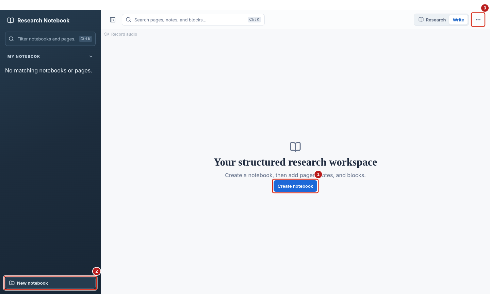

_Figure 1. (1) Create notebook; (2) New notebook; (3) Application menu (three dots). No account or onboarding wizard is required._

### Understand local storage

A **notebook** holds a research project. A **page** groups a topic. A **note** is a small document on a page. A **block** is one piece of that note: evidence, interpretation, a question, or media. You can have several notes on one page.

The app saves into a local SQLite database and managed asset folders. The authoritative location is **Application menu → settings → Library & Storage → Active library**. The initial location is Electron's per-user application-data folder (normally `%APPDATA%\research-notebook` on Windows and `$XDG_CONFIG_HOME/research-notebook`, or `~/.config/research-notebook`, on Linux). A relocated library can be elsewhere.

There is no cloud synchronization or sign-in in this build. Local work remains on this computer. OpenRouter transcription is a separate, optional network action. Editor text and note/page titles save when you leave their fields and before navigation or normal window closure. A save failure cancels navigation or closure so you can retry. Imported media is copied into managed storage. Keep the database and assets together when recovering a library.

## 2. Create notebooks, pages, and notes

**Before you start:** the app must be open. Use a demo notebook for destructive tests.

1. Select **Create notebook** on an empty library, or **New notebook** at the bottom of the sidebar (Figure 1, 1–2). The app creates **Untitled notebook** and its first **Untitled page**.
2. Click the notebook's title in the sidebar (Figure 2, 1), type **Learning research**, then click elsewhere. This saves the notebook name.
3. Click **Page title** at the top of the workspace (2), type **Reading and reasoning**, then click elsewhere. The sidebar page label updates.
4. Enter **Practice captures** in **New page** (3). Press **Enter**, or select the small **Create page** icon beside the field. The new page opens. Select a page's name in the sidebar to switch pages.
5. Select **Add note** (4), or **Create first note** when the page has no notes. Use **Add note** again for another note.

**Expected:** each note shows an editable **Note title**, **Move note to trash**, **Add block**, **Record audio**, and the command-menu button. New notes become active, including notes beyond the first 50-note batch. See Figure 38 for note actions.

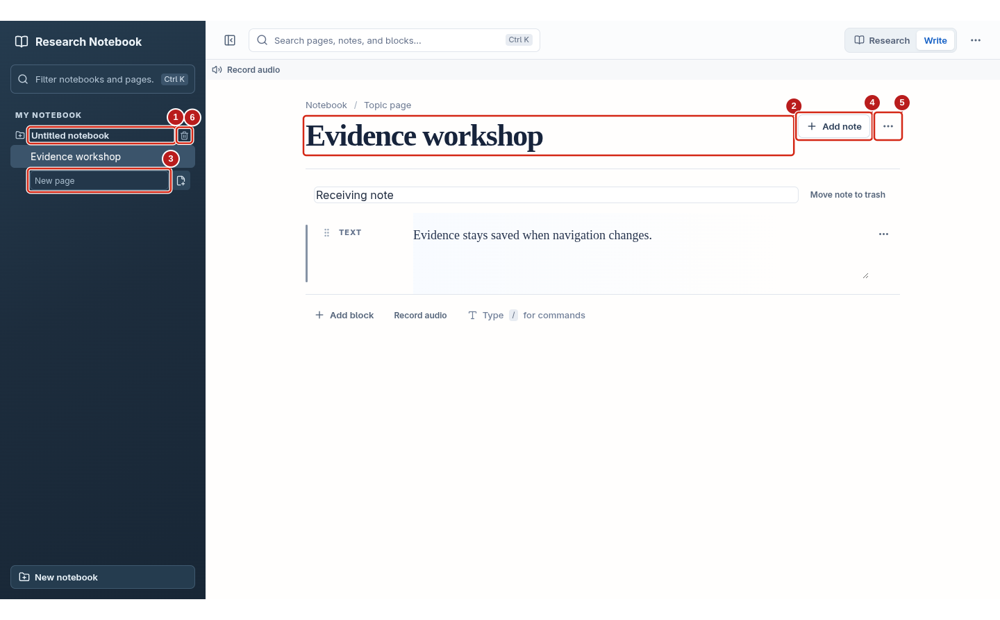

_Figure 2. (1) Notebook title; (2) Page title; (3) New page field; (4) Add note; (5) Page actions; (6) notebook trash icon._

**Recovery:** if a name does not save, leave the field and look for a top-of-window error. Do not assume an unsaved field survived closing the app. Selecting a different page changes the current workspace; it does not delete your previous work.

### Select the receiving note and load longer pages

1. Click into a text block or focus a control inside the note you want to use. Its document gets a focus outline. Merely clicking blank background is not a reliable way to select it.
2. Check **Capture to: …** in Research. Refreshes preserve the receiving note and loaded batches. If no note is selected, capture and attachment controls are disabled; select a note explicitly.
3. On a page with more than 50 notes, scroll to **Load more notes** and select it. Each click adds the next batch; the control disappears when there are no more notes.

**Expected:** the loaded notes remain visible and the next batch follows them. The pagination example uses 51 demonstration notes created by capture tooling; the actual **Load more notes** click was exercised.

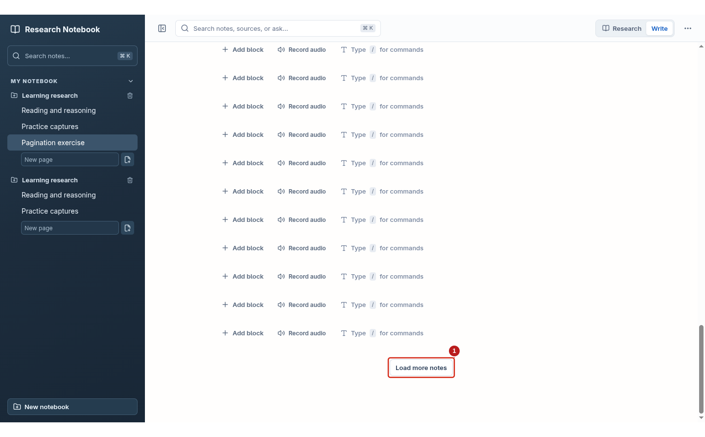

_Figure 3. (1) Load more notes. Use a control inside a note to make it active before capturing or exporting Active note._

## 3. Write and save semantic blocks

**Before you start:** open a page and add at least one note. Choose **Write** for the full-width editor.

1. Select **Add block** for a plain **text** block.
2. For another type, click **Type / for commands**, whose accessible label is **Open block command menu**. Choose the listed entry: **/source text**, **/commentary**, **/explanation**, **/question**, **/answer**, or **/quote**.
3. Type into the new block. Click elsewhere to save; there is no separate Save button.
4. Reopen the page to check that the content persisted. A visible error means the change may not have saved.

The seven text block types use the same plain text editor. They label the purpose of the content; they do not automatically evaluate, format, or answer it.

| Type        | Use it for                       | Demo example                                       |
| ----------- | -------------------------------- | -------------------------------------------------- |
| text        | General notes                    | State the research aim.                            |
| source text | Evidence or extracted material   | Keep evidence beside its source reference.         |
| commentary  | Your interpretation              | Explain what a reading suggests to you.            |
| explanation | Supporting reasoning             | Describe why comparing examples helps.             |
| question    | Something to investigate         | Ask how a worked example helps.                    |
| answer      | Your response                    | Give a concrete answer to check.                   |
| quote       | A quotation or memorable passage | Keep a short excerpt distinct from interpretation. |

A manually inserted **source text** or **quote** block does not automatically gain PDF provenance. Use PDF capture when you need a source/page link. The demo sentences in Figure 4 are invented notes, not quotations from the PDF.

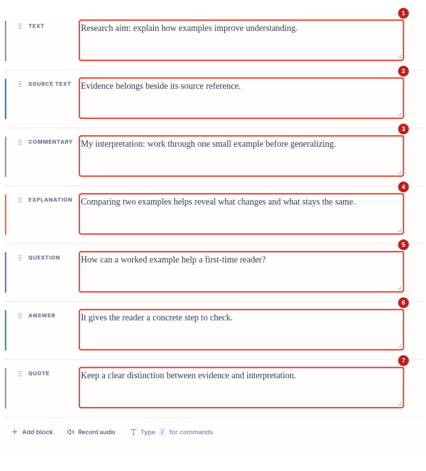

_Figure 4. Numbered markers identify the seven types in the table: (1) text; (2) source text; (3) commentary; (4) explanation; (5) question; (6) answer; (7) quote._

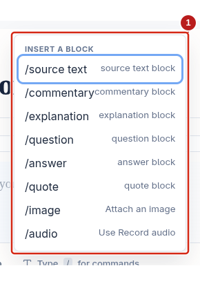

_Figure 5. (1) Insert a block menu. /image opens an image picker; /audio starts the recorder._

**Recovery and limits:** type `/` in an empty text block to open the command menu. Use Up/Down to choose, Enter to activate, and Escape to cancel. A slash in populated text stays text. **/audio** starts the same recorder as **Record audio**, with the same permission handling. Rich-text, code/table/divider insertion and standalone transcript insertion remain unavailable.

### Duplicate, move, answer, or delete a block

**Before you start:** create two or more blocks to test ordering, including a question.

1. Hover over a block or focus its controls, then click its three-dot **Actions for … block** button.
2. Choose **Duplicate** (Figure 6, 1). A copy is appended to the same note; check its position rather than expecting it immediately beside the original.
3. Choose **Move up** or **Move down** (2–3) to move one place. At the start/end of the note the corresponding command is disabled.
4. On a **question** block, choose **Add answer** (4). Fill the new blank answer and leave its field to save. The answer is appended and linked to the question by **responds to**.
5. Choose **Move to trash** (6) to remove a block recoverably. Open **Application menu → trash** to restore it as described in section 10.

**Expected:** order and new content persist after leaving and reopening the page. Duplication is a copy operation; verify any provenance or relationship you need rather than assuming every link was duplicated.

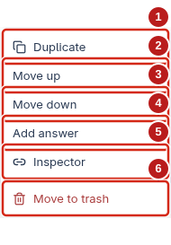

_Figure 6. (1) Duplicate; (2) Move up; (3) Move down; (4) Add answer; (5) Inspector; (6) Move to trash._

### Reorder with the mouse or keyboard

1. Drag the dotted **Drag … block to reorder** handle (Figure 7, 1) toward another block in the same note. Position in the upper half of the destination for “before”, or the lower half for “after”, then release.
2. Alternatively, focus a text block (2) and press **Alt + ↑** or **Alt + ↓**. Each press moves one position.
3. Check the resulting order. These controls reorder blocks within one note, not between notes or pages.

**Expected:** the block moves without creating another copy. If a drag fails, use **Move up/Move down**. Save your edit by leaving the field before testing ordering so an in-progress edit is easy to verify separately.

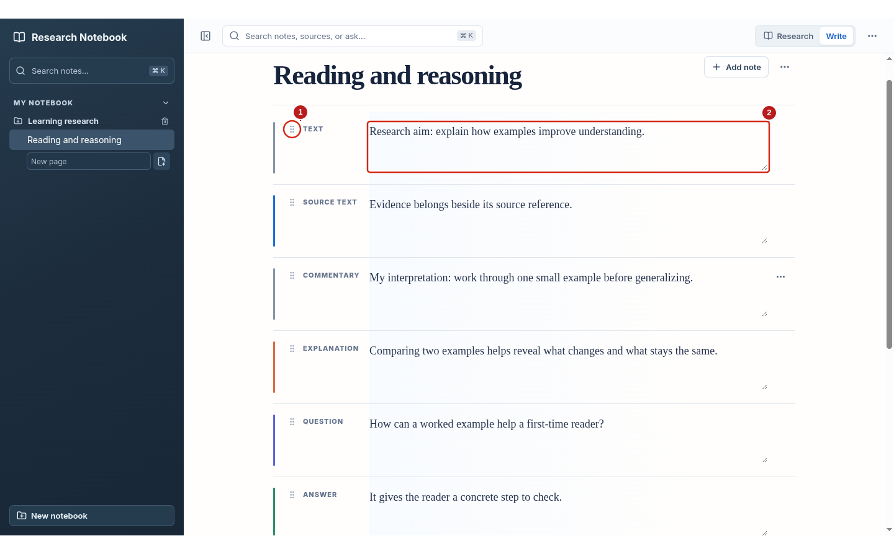

_Figure 7. (1) Drag handle; (2) text field for keyboard reordering._

### Convert blocks, link reasoning, and inspect metadata

**Before you start:** have at least two blocks in the loaded page.

1. Open a block's **Actions → Inspector** (Figure 6, 5). In **Convert block** (Figure 8, 1), select another of the seven text types. Text is preserved. Conversion is disabled for media/file blocks.
2. Select **Relation type** (2): **explains**, **responds to**, **comments on**, or **summarizes**. The direction runs from the inspected block to the chosen target.
3. Select **Link to…** in **Block to link** (3). Targets are other blocks in currently loaded notes on the page. Select **Link** (4).
4. Inspect the relation row (5). Use its small **Remove relation** cross to remove that relationship. This does not delete either block.
5. Read **Metadata** (6), then select **Close inspector** (7). Metadata is displayed as read-only JSON; there is no metadata editor here.

**Expected:** a relation label appears; the target picker excludes the current block. The UI lists relation labels without full target details, so record the target when testing. If a target is missing, use **Load more notes** first or check that it belongs to this page. For sourced blocks the inspector also offers **View source provenance**. It navigates to the source, rather than opening an editable provenance form.

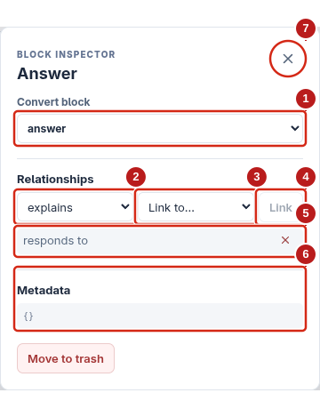

_Figure 8. (1) Convert block; (2) Relation type; (3) Block to link; (4) Link; (5) existing relation/removal; (6) Metadata; (7) close._

## 4. Read PDFs and capture evidence

**Before you start:** open a notebook page with a note. PDF import copies the selected file into managed assets for that notebook. Use a PDF without private information for test captures.

1. Select **Research** (Figure 9, 1). Select **Import** (2), the **Import PDF** icon, or **Import PDF** on an empty viewer. Choose a local `.pdf` in the operating system file picker.
2. Choose a previously imported PDF in **Source document** (3). Sources belong to the notebook, not just the current page.
3. Navigate with **Previous page**, **Next page**, or **PDF page** (Figure 10, 1–3). The number is the PDF's physical page, starting at 1. Commit with Enter or by leaving the field. Invalid values are clamped to the displayed total.
4. Use **Zoom out/Zoom in** (4–5). The initial zoom fits the pane width. Explicit zoom choices stay in effect until a source change; there is no separate reset-to-fit button.
5. If needed, enter a positive printed page number in **Print p. / Printed page** (6). This is a citation reference, not a navigation control. It clears when source/page changes, except when a source link restores recorded provenance; it is not automatically mapped to the book’s numbering.

**Expected:** the PDF renders beside notes. Scanned PDFs without a text layer may have no extracted text. This build does not perform OCR.

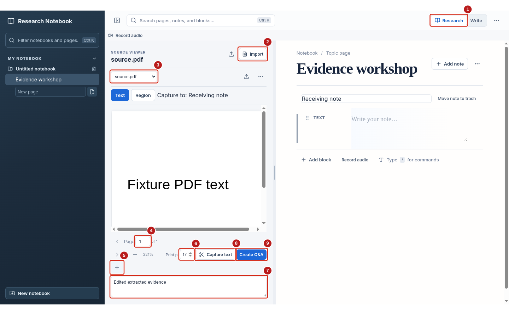

_Figure 9. (1) Research; (2) Import; (3) Source document; (4) PDF page; (5) zoom; (6) Printed page; (7) extracted text; (8) Capture text; (9) Create Q&A._

To compare documents, import another PDF, then choose it in **Source document**. Check the title above the selector and the displayed page before capturing. The updated comparison source is a renamed copy of the nonprivate PDF fixture, used to exercise switching and return-to-source navigation.

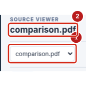

_Figure 9a. (1) Source document selector; (2) title of the selected second PDF. Switching to it and back was exercised._

### Capture text and create Q&A

1. Choose **Text**, select words on the PDF, or edit **Selected PDF text** (Figure 10, 7) down to the passage you need, or type/paste the text yourself. The field is initially populated with extracted text from the whole rendered page.
2. Focus a control inside the note that should receive the passage. Then select **Capture text** (8).
3. Check the new **source text** block and its **Source document · PDF p. …** link (Figure 11, 1–2). Captured text retains the PDF and physical page reference, plus the optional printed page reference.
4. For a Q&A instead, enter the question/evidence wording in **Selected PDF text**, then select **Create Q&A** (Figure 10, 9). This creates a **new note** on the current page with a sourced question containing that exact wording and a linked blank answer. Fill the answer (Figure 11, 3–4).

**Expected:** the capture field clears after successful capture. Q&A is a structural convenience; it does not generate an answer or turn a passage into a question using AI.

**Text mode:** normal PDF text selection is available through PDF.js’s text layer. Drag across words, then review the selection in **Selected PDF text**. You can also edit the full extracted page text. Zoom and resize preserve your edits. Use **Region** for rectangle capture. PDFs without selectable text require Region or manual text entry; OCR is unavailable.

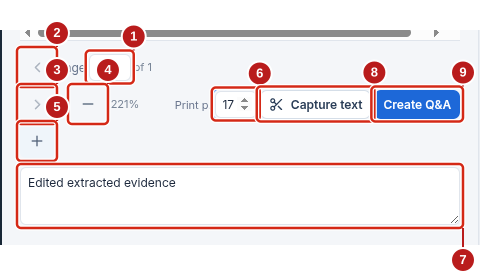

_Figure 10. (1) PDF page; (2) Previous page; (3) Next page; (4) Zoom out; (5) Zoom in; (6) Print p.; (7) Selected PDF text; (8) Capture text; (9) Create Q&A._

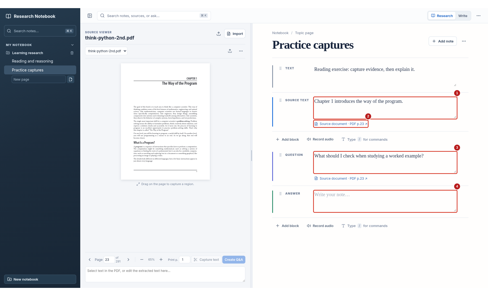

_Figure 11. (1) Source text; (2) source/page link; (3) new Q&A question; (4) blank answer._

### Capture a region and return to its source

1. Focus the receiving note and choose **Region**. On the PDF page (Figure 12, 1), press at the upper-left corner of the desired region, drag down and right, then release. Use a region larger than a few pixels.
2. Check the newly inserted screenshot block (2). Releasing completes the capture; there is no second “confirm region” button. If the wrong region was captured, move that block to Trash and try again.
3. While already in **Research**, select **Source document · PDF p. …**, **Actions → View source**, or **Inspector → View source provenance** on sourced material. Check that the correct document and physical page open.

**Expected:** region capture preserves bounds and the physical PDF page reference. Region capture does not store a printed page. **View source** from Write opens Research before applying the destination. Text provenance restores the recorded printed page; check the source and physical page before another capture.

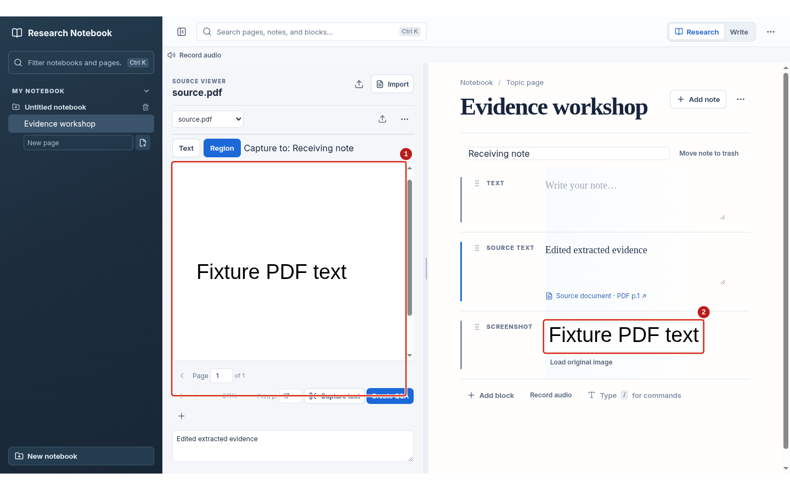

_Figure 12. (1) PDF region drag area; (2) captured region image._

### Make room for reading or writing

1. Select **Collapse notebook sidebar** in the upper-left toolbar. **Expand notebook sidebar** returns it (Figure 13, 1).
2. In Research, drag the vertical pane separator (2) left or right to resize the source and notes areas. Scroll the source and notes separately as needed.
3. Select **Write** (3) for a wide editing workspace. Select **Research** to return to the PDF.

**Expected:** switching modes saves pending editor changes and recordings first. Source links restore their explicit source/page provenance when Research mounts. Unsaved PDF selection drafts are page-specific; review them before changing source or page.

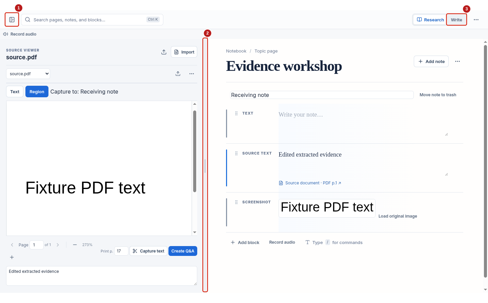

_Figure 13. (1) Expand sidebar; (2) pane separator; (3) Write._

## 5. Attach files, images, and audio

**Before you start:** have a note on the current page. For Research attachments, focus the intended receiving note before each import.

1. In **Research**, click the upload icon labeled **Attach media** in the source toolbar. Choose **Attach image**, **Attach screenshot**, **Attach audio**, or **Attach file** (Figure 14, 1–4).
2. Choose a local file. The app copies it into managed storage and adds a block to the active note, and shows its receiving note explicitly; controls are disabled if no note is selected. Cancel the picker to leave the note unchanged.
3. In **Write**, images can also be attached with **Type / for commands → /image** on the desired note.
4. Check an image/screenshot preview, the audio player, or **Download attached file** on a file block. Click that link to download a copy of an attachment.

**Expected:** images and screenshots show in the note. **Attach screenshot** imports an existing image; it does not take a desktop screenshot. Use PDF region capture for a PDF screenshot. All attachment blocks have the usual actions/inspector; text-type conversion is disabled for them.

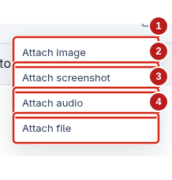

_Figure 14. (1) Attach image; (2) Attach screenshot; (3) Attach audio; (4) Attach file._

**Recovery:** if a preview stays on **Loading image preview…**, try **Load original image**. If it still fails or a player cannot load, open **diagnostics → Scan assets**. A file may import successfully but fail to play if the embedded browser does not support its audio format. Do not manually rename or move managed assets. File-download handling and audible playback need platform testing; no audible speech was verified in this capture session.

### Start and stop a recording

1. In the desired note, select **Record audio** (Figure 15, 1). Grant microphone access if the operating system requests it. A working input device is required.
2. Confirm that the button becomes **Stop recording** (Figure 16, 1). A red indicator and **Recording** status appear (2), with bars reflecting input level.
3. Speak briefly. **Microphone muted** or **Microphone disconnected** indicates an input problem; inspect system audio settings. Silent/low bars alone do not prove that no recording exists.
4. Select **Stop recording**. Wait for the audio block and player to appear. A WAV recording is saved locally.
5. Use the player's play/pause, seek, and volume controls (Figure 17, 1). Check the recording before attempting transcription.

**Expected:** stopping removes the live indicator and inserts one WAV audio block. Selecting another note, switching page/mode, opening Settings, closing, quitting or restarting stops and saves the recording first. If saving fails, the captured WAV remains in memory, navigation/closure is cancelled, and **Retry save** is available. Fix disk space or permissions and retry; do not force-terminate the process.

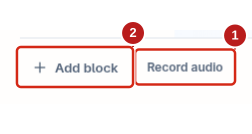

_Figure 15. (1) Record audio; (2) Add block._

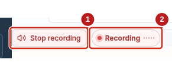

_Figure 16. (1) Stop recording; (2) Recording and input-level meter. This capture used Chromium's synthetic audio device, not a real microphone._

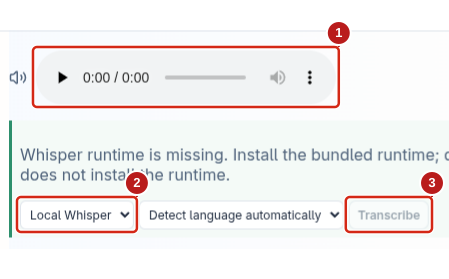

_Figure 17. (1) Audio player; (2) provider; (3) Transcribe. The block also offers a language hint._

**Recovery:** if microphone access is denied or no device is found, check the operating system's privacy/input settings, then select **Record audio** again. Real Windows/Linux permission prompts, muted/disconnected-device behavior, and audible playback remain manual platform checks. The recording start, stop, WAV creation and player rendering were exercised with synthetic input.

## 6. Set up and use transcription

**Before you start:** have an audio block with a playable recording/import. Local transcription requires both an installed Whisper model and the packaged **whisper.cpp** runtime. A model alone cannot repair a missing runtime. This source-build capture environment has no bundled Whisper executable, so local transcript success is **not verified**.

### Manage Local Whisper models

1. Open **Application menu → settings → Transcription** (Figure 18). The models are **Whisper Tiny**, **Base**, **Small**, **Medium**, and **Large-v3**, all multilingual.
2. Select **Download** on the model you want (3–4). Model downloads require internet access and free disk space. Tiny is the smallest listed model and a practical first test. The model files are downloaded from Hugging Face; audio stays local when transcribed with Local Whisper.
3. While downloading, watch **Downloading …%** and its progress bar. Select **Cancel** on that model to stop. Cancellation is also available for its queued/running job in **jobs**.
4. If downloading fails, inspect the displayed error and choose **Retry** when offered, or retry the cancelled job in **jobs**. Recheck disk space and connectivity first. A cancelled model can return to **Download**.
5. Once **Installed** appears, select **Use as default**. The chosen model shows a disabled **Default** button. The default is for subsequent local transcriptions.
6. To remove a model, first choose another installed default, then select **Remove** on the nondefault model and confirm the named model removal. The current default has no Remove button.

**Expected:** installed models and the chosen default survive restart. The capture session exercised download initiation/cancellation and job retry, then installed Tiny and Base, changed the default from Base to Tiny, and removed Base. A transient **fetch failed** error preceded a successful retry. Figure 19 shows the actual observed download state, not an invented installed state. Sizes use B, KB, MB and GB.

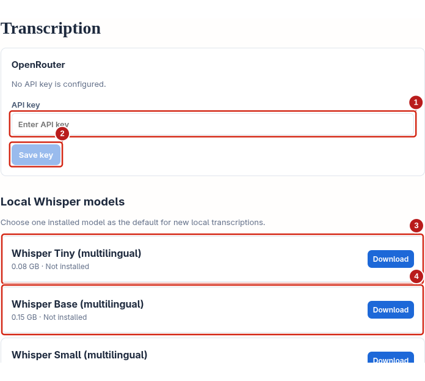

_Figure 18. (1) API key field; (2) Save key; (3) Tiny model/download; (4) Base model/download. No key was entered in these captures._

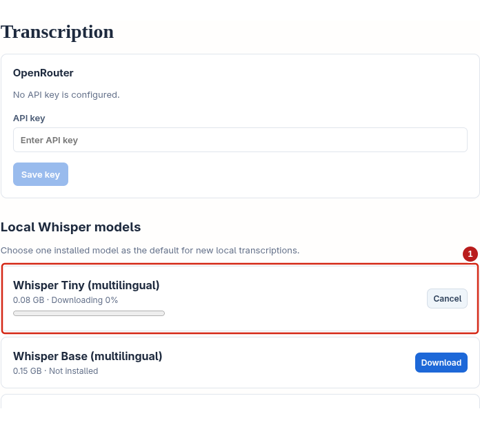

_Figure 19. (1) Actual Tiny-model download state before cancellation/retry._

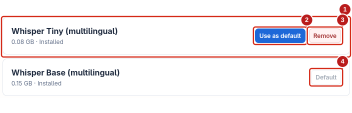

_Figure 19a. (1) Installed Tiny; (2) Use as default; (3) Remove; (4) Base is the current Default. Both files completed the app's download checksum checks._

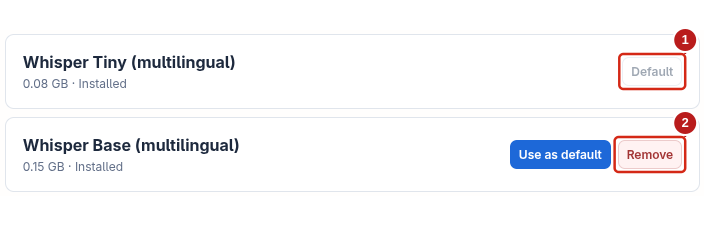

_Figure 19b. (1) Tiny is now Default; (2) Remove on nondefault Base. Default models cannot be removed with this control._

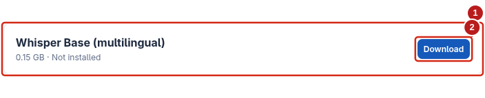

_Figure 19c. (1) Base is Not installed after removal; (2) Download again. The removal confirmation was accepted in the isolated demo._

### Request a transcript and interpret the result

1. Return with **Back to workspace**. In an audio block, choose **Local Whisper** or **OpenRouter** under **Transcription provider** (Figure 17, 2).
2. Choose **Detect language automatically**, or a language in **Language hint**. This is a hint for the request, not a translation control.
3. Select **Transcribe** (3). Local runs appear as queued/running jobs; the block polls for status and shows a percentage when available.
4. Check the status below the controls. On completion, transcript text is displayed there beside the provider/status. A transcript is derived information; the original audio remains attached.
5. On an error, read the top alert and **jobs** error, then inspect **diagnostics**. Local setup failures can happen before a run/job is created. For failed local jobs, use **Retry** after fixing the cause. Selecting **Transcribe** again starts another request; there is no visible transcript-history selector or transcript editor in this build.

**Expected in a configured installation:** a completed run with transcript text. **Observed in the updated build:** local execution is disabled with a missing-runtime explanation; OpenRouter is disabled without a configured key. Earlier captures retain historical setup errors. Neither successful transcription, recognition accuracy, language quality, nor cloud latency was verified.

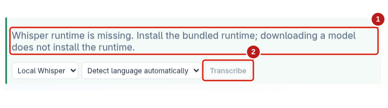

_Figure 20. (1) Missing-runtime explanation; (2) Transcribe remains disabled. No transcript was produced._

### OpenRouter credentials and privacy

**OpenRouter sends the audio to an external transcription service.** Choose it only for audio you intend to share externally. Provider usage may incur charges. No real provider credential or paid request was used. Save, replace and remove were tested with dummy local values; no cloud request was made while those values were configured.

1. In **settings → Transcription**, enter your key in **API key** (Figure 18, 1) and select **Save key** (2).
2. A configured key changes the controls to **Replace API key / Replace key** and **Remove key**. Replacement clears the visible entry field. Select **Remove key** and confirm to remove it.
3. Return to the audio block, choose **OpenRouter**, choose a language hint if needed, and select **Transcribe** only when you intend the external upload.

**Expected:** the UI reports whether a key is configured; it does not display the saved secret. This build stores its provider configuration locally. There is no in-app provider pricing page, cloud model selector, or cloud-transcription cancel button. Each audio block explains runtime/model readiness before enabling local transcription. Downloading a model does not install the runtime.

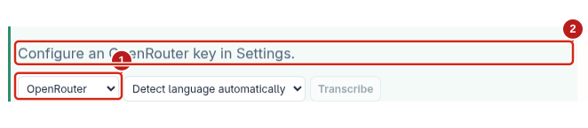

_Figure 21. (1) OpenRouter provider; (2) missing-key explanation; execution is disabled until configured. No successful cloud transcript is shown._

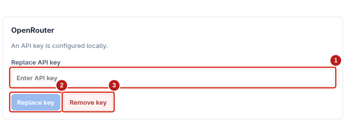

_Figure 21a. (1) Replace API key field; (2) Replace key; (3) Remove key. This is a dummy local value, not a validated provider credential. Save, replacement and confirmed removal were exercised without requesting transcription._

## 7. Search what is actually indexed

**Before you start:** save some text and titles. Trash content is excluded from the active search index.

1. Select the **top toolbar** search button, or press **Ctrl + K** on Windows/Linux (**Cmd + K** where supported).
2. Type a word, such as **example** (Figure 22, 1). Results update while typing.
3. Select a result (2). The containing page opens. A notebook-title result opens its first page; a block/note result opens a batch containing the note. There is no guaranteed scroll-to-block highlight.
4. Press **Escape** to close search without choosing a result.

**Expected:** matches from active notebook, page and note titles and stored block data. Search splits the query into word-like terms and matches prefixes; all query terms must match. Up to 100 relevance-ranked results are returned. It is not natural-language Q&A, exact phrase search, full PDF search, OCR, or a search of attachment bytes. Imported PDF text becomes searchable when captured as block text. Transcript display does not guarantee that transcript text is separately indexed.

The sidebar **Filter notebook and page titles** searches those titles as you type and shows **No matching notebooks or pages** when empty. The top search covers stored notebook/page/note titles and block text; its label makes no AI or PDF-content-search promise.

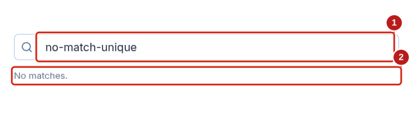

_Figure 22. (1) Search input; (2) distinct no-match state._

**Recovery:** an empty query shows initial guidance, a pending query shows **Searching…**, and a completed empty result shows **No matches.** Errors show **Search failed. Edit the query to retry.** Input is debounced by 150 ms and obsolete responses are discarded. Try a shorter prefix and check that the item is not in Trash.

## 8. Export, import, and make library backups

### Export a notebook, page, or active note

**Before you start:** save edits, open the page you want, and focus a control in the intended note if exporting **Active note**.

1. Open **Page actions → Export page** (Figure 23, 1).
2. In **Scope** (Figure 24, 1), choose **Notebook**, **Current page**, or **Active note**. Active note is disabled until a note is focused.
3. Select one of the exact format buttons: **markdown**, **pdf**, **lossless json**, or **ai context** (2–5).
4. Choose a destination folder in the operating system picker. Wait for the dialog to close, then inspect the new dated subfolder in that destination.
5. Open the resulting document and check scope, text and media. The export includes active content; it is not a copy of Trash or all library settings.

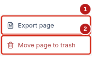

_Figure 23. (1) Export page; (2) Move page to trash._

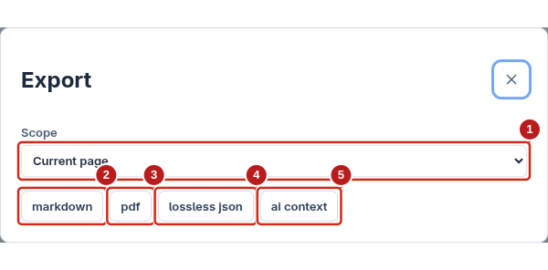

_Figure 24. (1) Scope; (2) markdown; (3) pdf; (4) lossless json; (5) ai context._

| Button        | Document in the export folder | What to expect                                                                                                                                                                   |
| ------------- | ----------------------------- | -------------------------------------------------------------------------------------------------------------------------------------------------------------------------------- |
| markdown      | `notebook.md`                 | Readable text and relative links to copied media.                                                                                                                                |
| pdf           | `notebook.pdf`                | Printable text and images; audio/files are represented as asset descriptions, with active transcript text when present.                                                          |
| lossless json | `notebook.lossless.v1.json`   | Versioned structured archive with the selected hierarchy, block data/metadata, in-scope relationships, transcription runs/segments, captured-source references and their assets. |
| ai context    | `notebook.md`                 | Markdown with explicit labels such as `[SOURCE]`, `[COMMENTARY]` and `[AUDIO TRANSCRIPT]`; the app does not send it to an AI service.                                            |

Every export subfolder also contains **manifest.json** and **assets/**. Keep the entire folder, especially for lossless import. Only source PDFs referenced by captured blocks are included; importing a PDF without capturing from it does not guarantee inclusion in an export. Relationships outside the selected scope are excluded. A narrow scope is not a whole-notebook archive.

**Recovery:** cancelling an export picker produces **Export was cancelled.** This is not data loss. A missing/unsafe asset can stop export; inspect diagnostics and the asset scan before retrying. There is no export-progress dialog or automatic opening of the output folder. This session completed all four formats across notebook, page and active-note scopes; see the verification record for the exact combinations.

### Import a lossless archive

**Before you start:** keep the `.json` file with its sibling **assets/** directory. Use the archive document, not **manifest.json**.

1. Open **Application menu → Import lossless archive…** (Figure 25, 1).
2. Choose **notebook.lossless.v1.json** in the file picker. The app validates structure, referenced files and asset checksums before importing.
3. The sidebar refreshes immediately and the imported notebook’s first page opens. Cancelling the picker leaves the current selection unchanged.
4. Find the imported notebook copy (Figure 26, 1). Open its pages and verify captured-source links and attachments.

**Expected:** a new notebook copy with new internal identifiers, rather than an overwrite of your current notebook. Importing again creates another copy. Markdown, PDF and AI-context exports cannot be imported through this command.

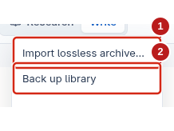

_Figure 25. (1) Import lossless archive… (lossless JSON only); (2) Back up library. The utility menu entries are lowercase in this build._

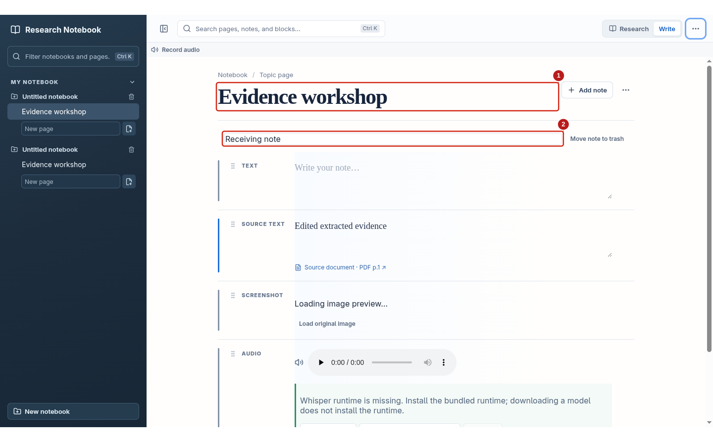

_Figure 26. (1) Imported page; (2) imported note title. The sidebar refreshed automatically and its first page opened._

**Recovery:** if import reports invalid schema, a broken reference, or an asset integrity error, retain the original export folder and report the exact message. Do not hand-edit archive identifiers or overwrite your live database to force an import. A cancelled import picker makes no import.

### Back up the whole library

**Before you start:** choose a destination outside the active library and keep enough free disk space. Stop recordings first.

1. Select **Application menu → Back up library** (Figure 25, 2), or **settings → Maintenance → Back up library** (Figure 27, 1).
2. Choose a destination folder. Open **jobs** to watch the **backup** job.
3. Wait for **succeeded** (Figure 28, 1). Inspect the new **research-notebook-backup-…** directory.
4. Keep **database.sqlite**, **assets/**, **manifest.json**, and **RECOVERY.md** together. Keep a separate copy on another disk if this is your safety copy.

**Expected:** a consistent database snapshot and all database-managed assets, including assets still present for deleted content. Hash verification checks copied assets. The library backup does **not** copy the provider configuration, downloaded models, or the library-bootstrap pointer. Library relocation copies a broader set of files than this backup.

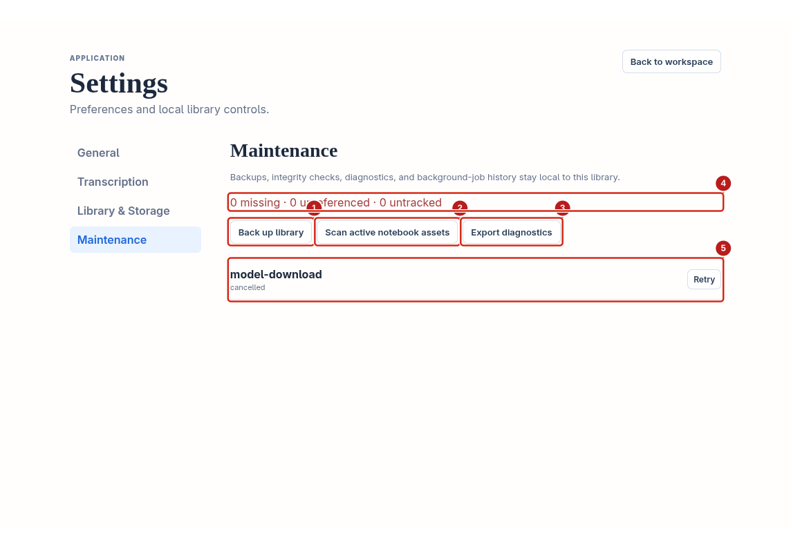

_Figure 27. (1) Back up library; (2) Scan active notebook assets; (3) Export diagnostics; (4) scan counts; (5) job history._

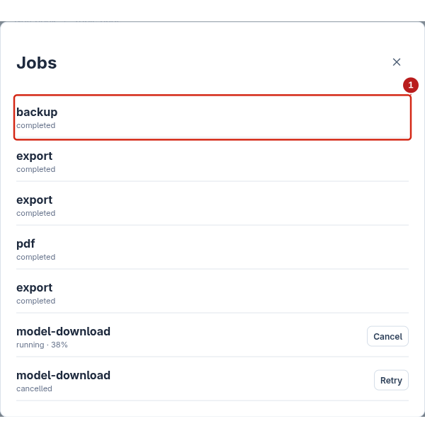

_Figure 28. (1) Backup job. A closed picker alone does not prove backup completion._

### Recover a library backup separately

**There is no whole-library recovery button. “Import lossless archive…” is not the recovery path for a library backup.** Ask the maintainer to assist if you are unfamiliar with moving application data.

1. Record **Active library** under **settings → Library & Storage**. If the app cannot start, use the last recorded path and check for a relocation pointer before assuming the default folder is active.
2. Close Research Notebook completely. Preserve the **entire current library** in a separate recovery folder, including database sidecars if present. Do not merge old and new assets or restore over an open database.
3. Open the backup's **RECOVERY.md**. Verify each `manifest.json` asset SHA-256 against the file it names. The manifest covers asset hashes, not a database hash. Have the maintainer check the database's SQLite integrity too.
4. In the verified active library location, place the backup's **database.sqlite** and **assets/** together. Ensure stale **database.sqlite-wal** and **database.sqlite-shm** from the former library are not left beside the restored database; preserve them with the former library instead. Do not discard your recovery copy.
5. If the library was relocated, preserve the bootstrap pointer and restore to the path it actually selects. Have the maintainer resolve a missing/invalid target; do not guess by deleting the pointer.
6. Relaunch the same compatible build. Verify notebook/page counts, text, source links, audio and files. Reconfigure provider credentials or models if needed. If startup or migration fails, close the app and preserve the failed restored copy for support.

**Expected:** the restored database and its assets form the selected library. This is a filesystem recovery procedure, distinct from copy-on-import. A separate disposable recovery check accompanies the build instructions; never practice it on your only live library.

## 9. Settings, storage, jobs, and diagnostics

### Appearance and density

1. Open **Application menu → settings → General**.
2. Choose **Appearance**: **Use system setting**, **Light**, or **Dark** (Figure 29, 1).
3. Choose **Layout density**: **Default** or **Compact** (2).
4. Select **Back to workspace** (3).

**Expected:** appearance and density apply immediately and persist. No restart is required for these preferences. System follows the operating system's theme. If a layout is difficult to read, return to Default density.

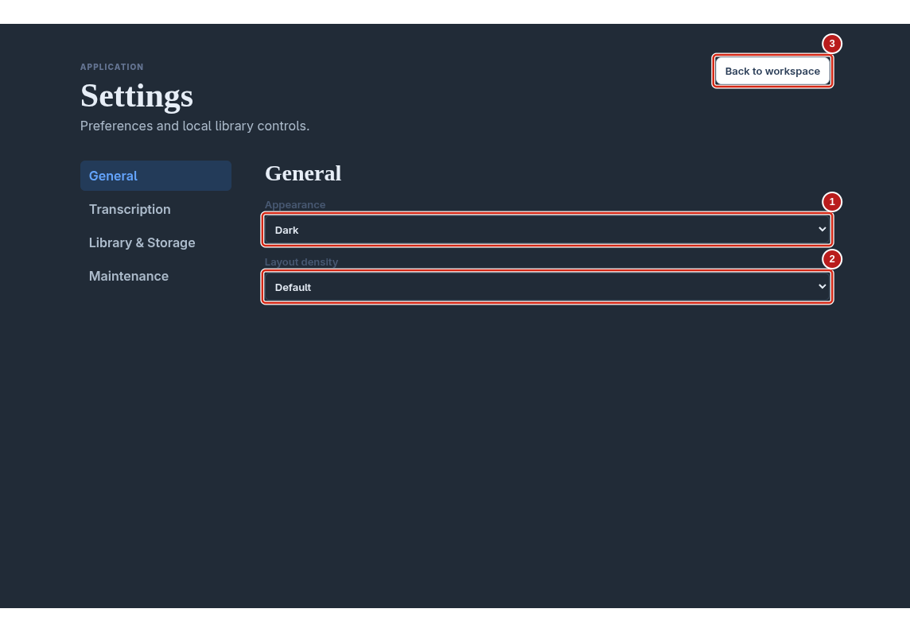

_Figure 29. (1) Appearance; (2) Layout density; (3) Back to workspace._

### Relocate the library and remove the retained original

**Before you start:** make a library backup and choose a destination outside the active library. The app saves editors and recordings before moving. Finish or cancel all background write jobs first. Once the move is queued, content changes, imports, settings changes and new jobs are blocked through restart; the original process cannot accept new edits into a stale snapshot.

1. Open **settings → Library & Storage**. Record **Active library** and the database/assets/models sizes (Figure 30, 1). Size displays can be coarsely rounded; check available space in the file manager.
2. Select **Move library…** (2) and choose a parent destination folder. The app creates a new **research-notebook-library-…** subfolder, copies database/assets/configuration/models, and verifies the copy.
3. Wait for the persistent **Library move verified** notice. It explains that editing is paused until restart. Failed/cancelled moves release the restriction and retain the original.
4. Select **Restart now**. Return to **Library & Storage** and verify the new **Active library** path. Open content and check attachments before removing the original.
5. The original remains listed under **Original retained at …** (2). When satisfied and backed up, choose **Remove original** (3) and confirm **Permanently remove the original library? This cannot be undone.** This permanently removes the retained original library files.
6. Confirm that the retained-original section disappears (Figure 33). Keep your independent backup.

**Expected:** activation happens only after restart. Cancelling the destination picker does not move the library. If verification fails, retain the original, read jobs/diagnostics and fix the cause before retrying. Do not manually delete the original while a move or pre-restart process is active. The isolated demo exercised copy, restart, activation and original removal.

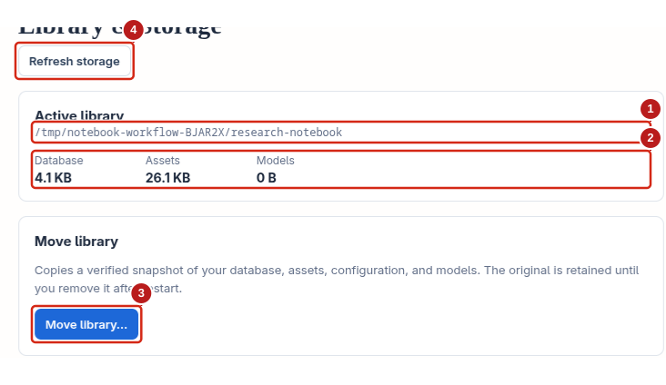

_Figure 30. (1) Active library; (2) size summary; (3) Move library…; (4) Refresh storage._

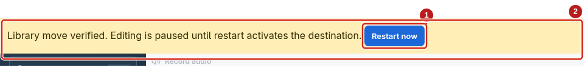

_Figure 31. (1) Restart now; (2) persistent explanation of editing restrictions._

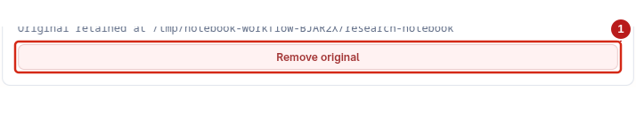

_Figure 32. (1) Remove original is available after destination activation. The actual confirmation is a native prompt, not shown in this screenshot._

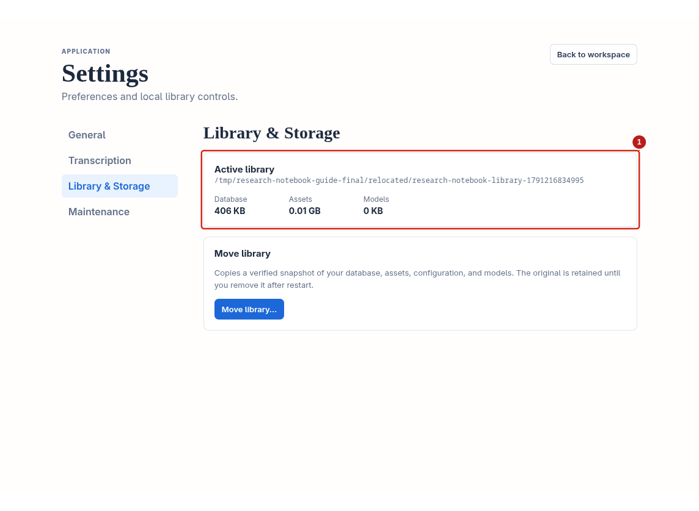

_Figure 33. (1) Active relocated library. The original section has disappeared._

### Jobs: progress, cancellation and retry

1. Open **Application menu → jobs** (Figure 25, 3), or view the same job controls in **settings → Maintenance**.
2. Read the job's kind and status (Figure 34, 1): **queued**, **running**, **succeeded**, **failed**, or **cancelled**. Running jobs display progress; completed ones do not offer cancel/retry.
3. Select **Cancel** for a queued/running job. Cancellation can wait for a checkpoint; verify the eventual status.
4. Fix a failed job's cause, then select **Retry** for a failed/cancelled job. Retry creates another attempt rather than hiding the old row. Confirm the new attempt's status.

**Expected:** local transcription, model downloads, backups and library moves use this job system. Jobs displays up to 100 recent records and refreshes periodically. Cloud transcription and exports do not have the same queued-job UI. Restarting during a running job marks it interrupted/failed, while queued work can resume. Retry interrupted work after checking the previous output.

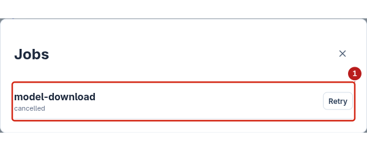

_Figure 34. (1) Actual job history, status and conditional Retry. Cancel is shown only while work is queued/running._

### Diagnostics, details, export and asset scans

**Before you start:** open a page so an active notebook is available for asset scanning. Keep error reports local until you review them.

1. Open **Application menu → diagnostics** (Figure 25, 4).
2. Filter by **All processes** (Figure 35, 1), **All severities** (2), or **Category** (3). Process options include renderer, preload, main, service, job and lifecycle; severities are warning, error and fatal. Clear filters if expected records disappear.
3. Expand an error's summary, then select **Show full detail** (5). Read the displayed structured information for message, context and stack details. These records describe failures; they are not a history of every user action.
4. Select **Export diagnostics** (4) and choose a folder. Check the reported output path. Exported diagnostics include saved errors and job-event information. Review text for local paths and content before sharing with maintainers.
5. Select **Scan assets**, or **settings → Maintenance → Scan active notebook assets** (Figure 27, 2). Read the counts for **missing**, **unreferenced**, and **untracked** (Figure 27, 4).

**Expected:** scans report problems without deleting or repairing assets. The displayed counters do not provide a per-file repair UI or show every internal check (for example, checksum mismatch detail). Full local error records may contain more debugging context than sanitized job summaries. **Export diagnostics** is a local file operation; it does not submit feedback.

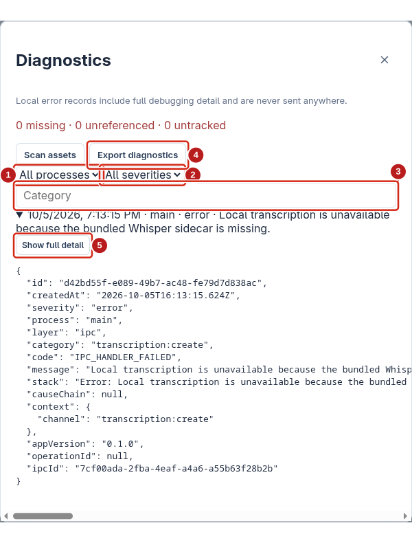

_Figure 35. (1) Process filter; (2) severity filter; (3) Category; (4) Export diagnostics; (5) Show full detail._

**Recovery:** for missing assets, preserve the library and report the counts; do not delete untracked/unreferenced files blindly. An unreferenced asset can still matter to an export or recovery. “No matching saved errors” can mean the filters are too restrictive. A top error alert has **Dismiss**; dismissing it does not undo a failure or delete its diagnostic record.

## 10. Trash and destructive actions

**Before you start:** test with disposable material and make a backup before permanent deletion. Trash is local and has no automatic timed deletion in this UI.

1. To remove a **block**, use **Actions → Move to trash**, or **Inspector → Move to trash** (Figure 6, 6).
2. To remove a **page**, use **Page actions → Move page to trash** (Figure 23, 2). This also moves active notes and blocks beneath that page.
3. To remove a **notebook**, select its small trash icon next to its sidebar title (Figure 2, 6). This also moves its active pages/notes/blocks. There is no confirmation before these recoverable moves.
4. Open **Application menu → trash**. Find the item using its title, entity type and deletion date (Figures 36–37). Descendants deleted with a parent are represented by that parent row rather than shown as separate rows. Select **Restore** (1/2).
5. Reopen the notebook/page and check the restored descendants. Restoring a parent also restores items removed with that same deletion action. Items independently deleted earlier remain in Trash. If restoring a child fails because its parent is still deleted, restore the parent first.
6. Select **Delete** only when the item is no longer needed. The confirmation names the item and warns that deletion is irreversible and includes descendants. **Cancel** has initial focus. Select **Permanently delete** to commit; Escape or Cancel keeps the item in Trash (Figure 42).

**Expected:** restoring returns the item to the hierarchy. Permanently deleting a parent removes descendants too. Physical asset cleanup is separate. Use **Move note to trash** for direct note deletion. There is no visible Empty Trash command.

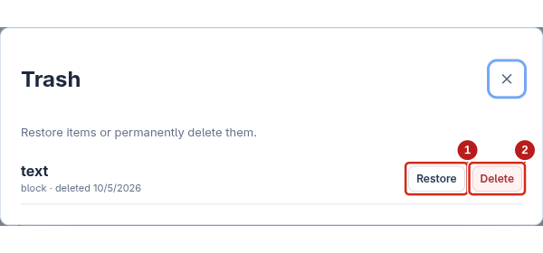

_Figure 36. (1) Restore; (2) permanent Delete. Delete opens a confirmation; Cancel is the default._

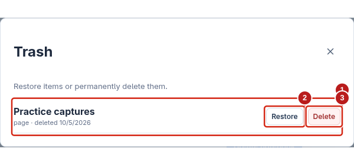

_Figure 37. (1) Deleted page entry representing its descendants; (2) Restore; (3) permanent Delete._

**Recovery:** restore the parent for a complete deletion operation. If the wrong item was permanently deleted, preserve the library and use a verified earlier export/backup through its appropriate recovery path. Do not expect Trash to reconstruct permanently deleted content.

## 11. Shortcuts and troubleshooting

| Shortcut             | Working action                                                                                    |
| -------------------- | ------------------------------------------------------------------------------------------------- |
| Ctrl/Cmd + K         | Open/focus the top search dialog.                                                                 |
| Ctrl/Cmd + Shift + N | Add a note to the current page. A page must be open.                                              |
| Alt + ↑ / Alt + ↓    | Move the focused text block within its note.                                                      |
| Enter in New page    | Create the page named in that field.                                                              |
| Escape               | Close ordinary menus/search/dialogs. The block inspector has an explicit Close inspector control. |

The toolbar's `⌘ K` hint is also visible on Linux/Windows; use **Ctrl + K** there. There is no documented slash-key insertion shortcut or global manual-save shortcut.

| Problem                                              | What to try and what to record                                                                                                                                 |
| ---------------------------------------------------- | -------------------------------------------------------------------------------------------------------------------------------------------------------------- |
| App will not start                                   | Keep the exact startup/database message, app version and package name. Preserve the library; do not delete the database.                                       |
| Text or title seems unsaved                          | Leave the field, check the alert, reopen the page. Record whether an error appeared.                                                                           |
| Capture landed in the wrong note                     | Focus a control inside the intended note before each capture. Workspace reloads clear active selection. Trash the mistaken block after preserving its content. |
| PDF words cannot be selected                         | Choose Text and select words; use Region for rectangles. Without selectable text, enter evidence manually; OCR is unavailable.                                 |
| Selected text changes unexpectedly                   | Complete capture before page/zoom changes, which refill extracted text.                                                                                        |
| Source link opens Research but not the expected page | Click it again once the viewer has mounted, or choose source/page manually. Record both clicks.                                                                |
| PDF is blank or has no extracted text                | Check rendering errors; try another PDF. Scanned documents may need external OCR.                                                                              |
| Recording does not start                             | Check microphone permission, connected input and the error alert. Use Record audio or /audio; both use the same recorder.                                      |
| Recording vanished after navigating                  | Normal navigation and closure save automatically. On failure, stay in the app and use Retry save; forced process termination cannot recover in-memory audio.   |
| Local transcription reports a missing sidecar        | Obtain a package with its supported Whisper runtime from the maintainer. Downloading a model alone is insufficient.                                            |
| Model download fails or stalls                       | Check network, disk space and jobs. Cancel, then retry after fixing the cause. Do not claim Installed until it appears.                                        |
| Cloud transcription fails                            | Check key configuration and service error; consider network/provider limits. Avoid repeated paid requests without understanding the failure.                   |
| Import completed but no notebook appears             | The tree refreshes immediately. Check the import error and verify notebook.lossless.v1.json and its assets.                                                    |
| Export or backup fails                               | Check destination permissions, disk space, asset scan and diagnostics. Do not use a partial folder as a verified backup.                                       |
| Library path did not change after Move library       | Wait for verified-copy status, select Restart now, then check Active library.                                                                                  |
| Restore fails                                        | Restore the deleted parent first; inspect diagnostics if it still fails.                                                                                       |

## 12. Guided first session

**Before you start:** use a disposable library/notebook, a nonprivate PDF, a small local image, and a microphone if you want to test recording. Plan about 20–30 minutes, excluding downloads. This exercise reuses the annotated instructions in sections 2–10.

1. Create **Learning research**, rename its first page **Reading and reasoning**, and add a note (Figure 2).
2. Add **text** describing a research aim, **commentary** giving your interpretation, and a **question** (Figures 4–5). Leave each field to save.
3. Use **Add answer** on the question and fill the answer. Open its Inspector to confirm **responds to** (Figures 6 and 8).
4. Duplicate a block, reorder it using a menu and **Alt + ↑/↓**, then move the duplicate to Trash and restore it (Figures 6–8 and 36).
5. Create **Practice captures**, add a note, choose **Research**, and import your PDF (Figures 2 and 9).
6. Navigate to a readable page, edit the extracted field down to a passage, focus your note and select **Capture text**. Create a separate Q&A note and capture a small region (Figures 10–12).
7. Click the source link while already in Research and confirm the correct PDF/page. Resize the divider and toggle the sidebar (Figures 11–13).
8. Attach an image and a file. If permitted, record a short clip and stop it before navigating. Listen back (Figures 14–17).
9. Inspect transcription setup. Try Local Whisper only when its runtime/model are available. Record an unavailable prerequisite as **blocked**, not as a successful transcript (Figures 18–21).
10. Search for a saved word. Export Current page as Markdown and PDF, then Notebook as lossless JSON. Inspect each complete output folder (Figures 22–24).
11. Import the lossless archive as a new copy; relaunch to check the sidebar. Make a whole-library backup and confirm its succeeded job separately (Figures 25–28).
12. Reopen the app and verify your text, captures and files. Export diagnostics if there were errors. Submit feedback with the template below through your team's chosen channel.

**Expected:** you can trace evidence back to a PDF, distinguish it from your interpretation, recover a trashed item, and find an export and a separate library backup. Stop if a destructive step would affect real research; the guide's screenshots demonstrate only isolated demo content.

## 13. Tester feedback template

Copy this into your team's issue tracker or message. Research Notebook does not submit it automatically.

```text
Title: [short description]
App version: 0.1.0 (also record package/build filename or commit if known)
Date/time and timezone:
Platform: Windows/Linux, OS version, x64, package format
Library: fresh/existing/relocated (omit private absolute paths)
Feature and guide section/figure:
Prerequisites: PDF/audio format, runtime/model, provider, permissions
Reproduction steps:
1.
2.
3.
Expected result:
Actual result and exact error text:
Frequency: once / sometimes / every time
Result: passed / failed / blocked by prerequisite / not tested
Data impact: unsaved edit / wrong target / missing attachment / none
Relevant job kind/status:
Diagnostics process/severity/category and error timestamp:
Attachments: redacted screenshot and reviewed diagnostics export
Recovery attempted and result:
Other observations (including guide/UI mismatches):
```

Share only the relevant, reviewed diagnostics and redacted screenshots. Note if recording used synthetic input, a real microphone, or imported audio, and if a transcript was actually produced. A disabled button, an initiated request, or an opened dialog is not evidence of successful completion.

## 14. Updated reliability controls

The following controls supplement the earlier workflow figures. Captures were taken from the updated Linux build in a disposable library. Real microphones, Windows installation, successful Whisper execution and cloud credentials remain external verification checks.

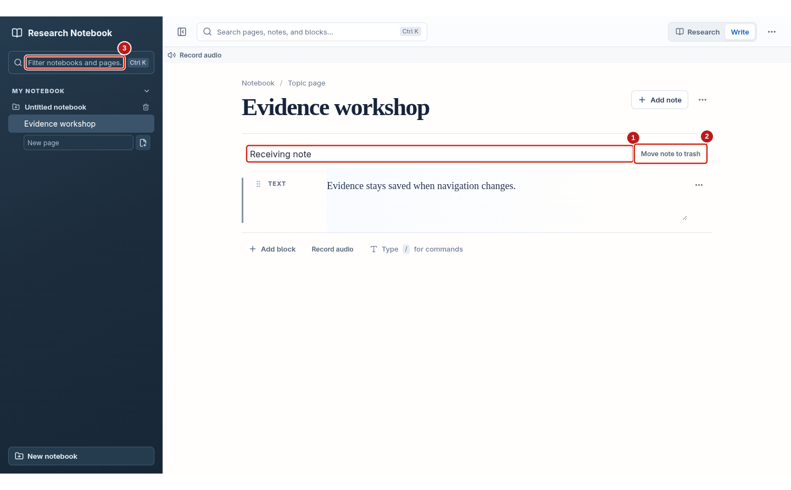

_Figure 38. (1) Edit Note title; (2) Move note to trash; (3) filter notebook and page titles. Leaving an editor field or normal navigation saves pending edits._

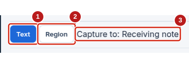

_Figure 39. (1) Text for normal PDF selection; (2) Region for rectangular captures; (3) explicit capture destination. Source/page changes clear draft selection and printed-page input; source links can restore recorded provenance._

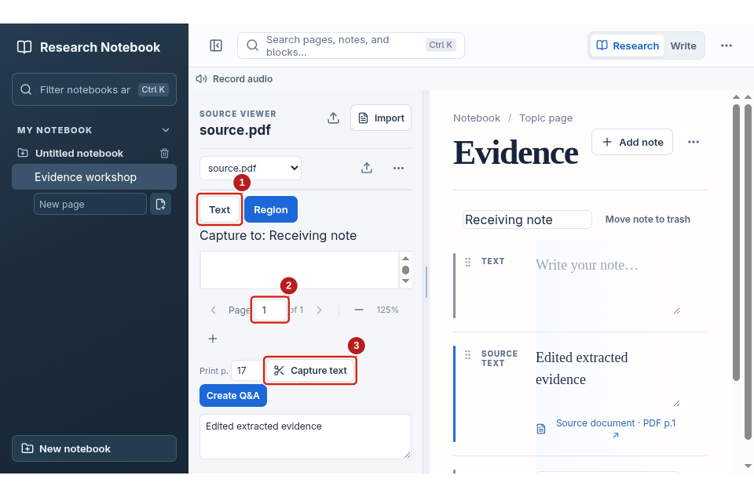

_Figure 40. (1) Text mode; (2) page controls; (3) capture controls. Controls wrap while the PDF itself scrolls._

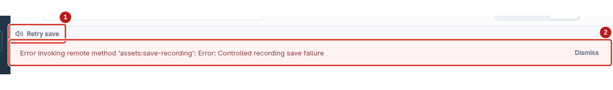

_Figure 41. (1) Retry save retains the original destination and WAV; (2) failure explanation. Fix the reported problem, retry, and wait for the player. Failed saving cancels navigation and normal closure. Forced process termination remains outside recovery support._

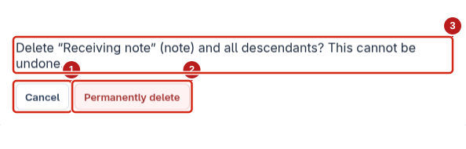

_Figure 42. (1) Cancel initially receives focus; (2) Permanently delete commits irreversible deletion; (3) the item/descendant warning. Escape cancels. Restore remains available after cancellation._

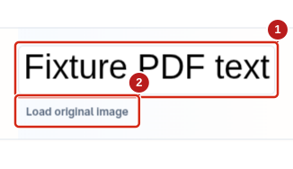

_Figure 43. (1) Cached preview loaded near the viewport; (2) Load original image requests the full asset. Use this control to inspect detail; previews avoid reading all full image assets at page opening._

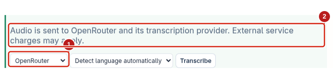

_Figure 44. (1) External provider choice; (2) audio transfer and charges disclosure. This capture configured a dummy key only and made no external transcription request. Choose local transcription when the required runtime/model is available._
